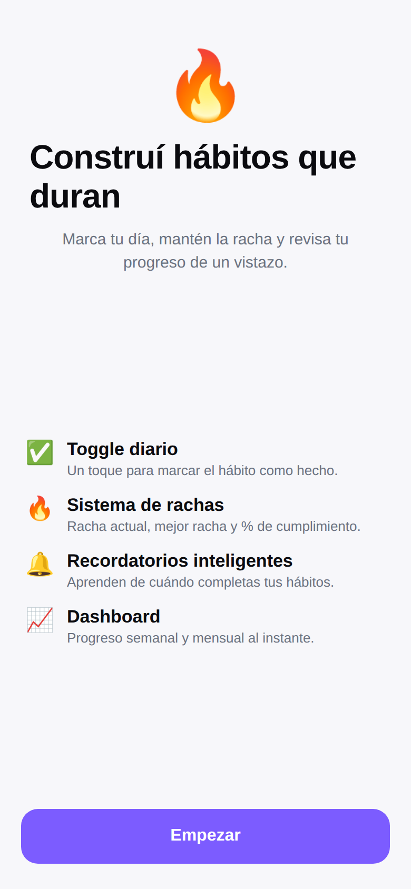
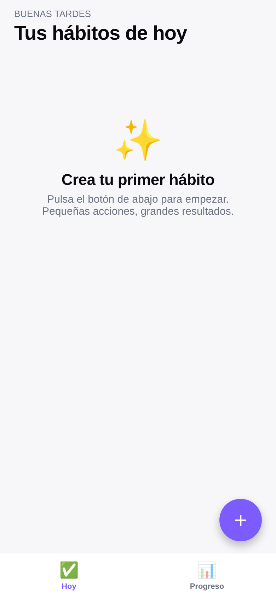
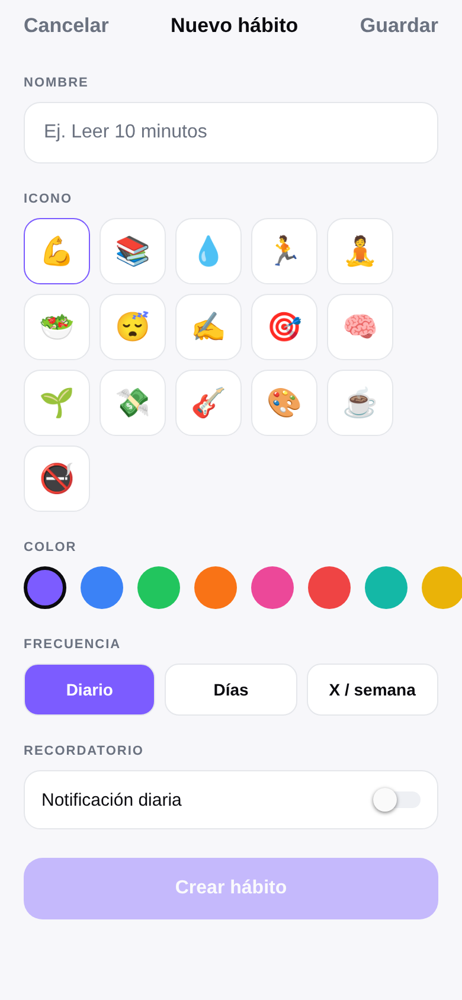
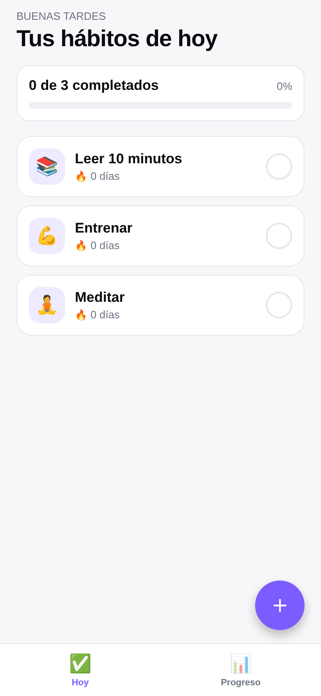
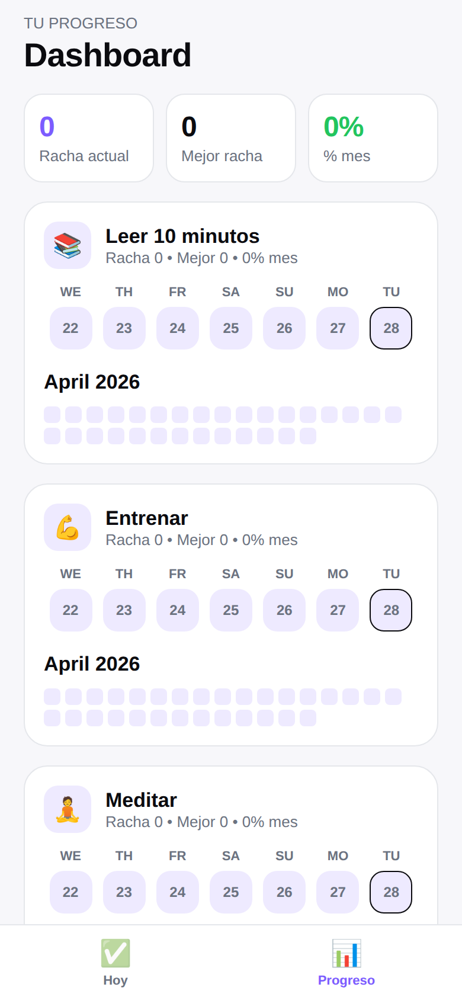
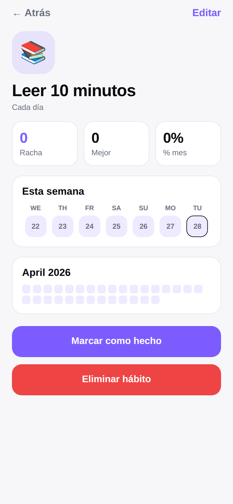

# Hábitos

App de seguimiento de hábitos para iOS y Android, lista para publicar en App Store y Google Play.

Stack: **React Native + Expo (managed) + TypeScript**, navegación con React Navigation, estado con Zustand, persistencia con AsyncStorage, notificaciones con `expo-notifications`.

## Capturas

| Onboarding | Home vacía | Crear hábito | Home con hábitos |
|---|---|---|---|
|  |  |  |  |

| Dashboard | Detalle del hábito |
|---|---|
|  |  |

## Funcionalidades

1. **Home simple** — tarjetas de hábito con toggle diario y contador de racha.
2. **Sistema de rachas** — racha actual, mejor racha y % de cumplimiento (30 días).
3. **Recordatorios inteligentes** — sugiere la mejor hora de notificación basándose en cuándo el usuario suele completar cada hábito.
4. **Dashboard** — progreso semanal y heatmap mensual por hábito.
5. **Flujo de creación** — frecuencia (diaria, días específicos, X por semana), recordatorios y *habit stacking* (encadenar tras otro hábito existente).

Reglas de UX cumplidas:
- **UX ultra rápida**: actualizaciones optimistas; sin spinners visibles. La hidratación inicial se hace contra una pantalla del color del fondo.
- **Datos persistentes**: AsyncStorage con clave única + writes async tras cada mutación.
- **Diseño limpio y motivador**: paleta sobria, dark mode automático, micro-animaciones con Reanimated y feedback háptico al marcar.

## Estructura

```
App.tsx                     # Root: providers, hidratación, NavigationContainer
index.ts                    # Entry point Expo
app.json                    # Config Expo (iOS bundle id, Android package, plugins)
eas.json                    # Build profiles + submit config
src/
  navigation/               # Stack + bottom tabs
  screens/                  # Home, Dashboard, CreateHabit, HabitDetail, Onboarding
  components/               # HabitCard, WeekStrip, MonthHeatmap, StatPill, etc.
  store/habitsStore.ts      # Zustand store (CRUD + toggle)
  services/                 # storage, notifications (con sugerencia inteligente)
  utils/                    # streaks (current/best/rate) y dates
  theme/                    # paleta + tipografía + tokens
  types/                    # modelos Habit, Frequency, etc.
```

## Cómo correr en local

Requisitos: Node 20+, Xcode (para iOS) y/o Android Studio (para Android), o Expo Go.

```bash
npm install
npx expo start          # abre con Expo Go o pulsa i / a para simulador
```

## Build de producción

Configura tu cuenta de Expo y reemplaza `extra.eas.projectId` en `app.json` por el id real (`eas init` lo hace automáticamente).

```bash
npm i -g eas-cli
eas login
eas init                 # vincula proyecto y rellena projectId

# Builds para las stores
eas build --platform ios          # .ipa firmado para App Store
eas build --platform android      # .aab para Google Play
eas build --platform all          # ambos
```

## Submit a las stores

Antes de enviar:
- Completa `assets/` con los iconos y splash reales (ver `assets/README.md`).
- Edita `eas.json` → `submit.production` con tus credenciales: `appleId`, `ascAppId`, `appleTeamId` (iOS) y la ruta del `service-account.json` de Google Play (Android).
- Cambia `bundleIdentifier`, `package` y nombre en `app.json` si necesitas un identificador propio (actualmente `com.habitos.app`).

```bash
eas submit --platform ios
eas submit --platform android
```

Para el versionado, `eas.json` usa `appVersionSource: remote` y `autoIncrement: true`, así no tienes que tocar `versionCode`/`buildNumber` a mano.

## Notificaciones

- En el onboarding se piden permisos.
- Cada hábito puede tener una hora de recordatorio (HH:MM, 24h). Se programa una notificación diaria persistente vía `expo-notifications`.
- En el detalle del hábito, si hay ≥3 completados, la app sugiere una hora ~15 min antes de la mediana de tu hora habitual de completado (recordatorio inteligente).

## Roadmap rápido

- [ ] Widgets nativos (iOS WidgetKit, Android App Widget) con un módulo nativo o `expo-modules`.
- [ ] iCloud / Google Drive backup.
- [ ] Pantalla de logros / hitos de racha.
